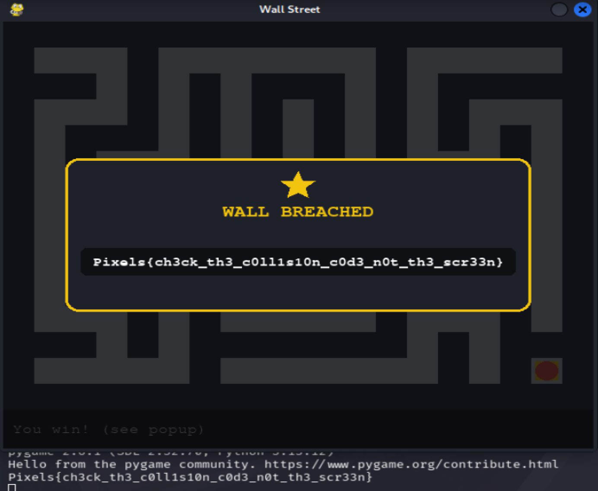

Weak wall · MD
# Weak Wall - Walkthrough

**Category:** Reverse Engineering

## TL;DR

`maze.py` is a simple pygame maze. The gold goal tile appeared totally inaccessible from all directions. We simply ran the game and walked through the maze manually, and found out that one of the "walls" near the goal room was actually walk-through, leading to the goal and giving us the flag.
 
## Recon

Got the source code `maze.py`. Run it with:

```
pip install pygame
python maze.py
```

The maze contains the start tile and the gold goal tile in the bottom-right corner, which appears to be walled on all sides as far as one can see.


 
## What we did
But first we didn’t dive into collision code, we played it and walked in the maze, marking all dead ends, and trying to check the goal area for collision because it was obvious that it should be checked there.

It turned out that one of the tiles located nearby the goal looked identically to all other walls in the game, but walking into it did not block our way we were allowed to walk right inside the goal tile. It means that somewhere in the game code collision checks and drawing tiles are implemented in a separate manner, and only one of the tiles was left outside the collision detection but remained on the map as usual wall. There was no need to find the solution in the source code it was enough to see that the game allowed us to go through the place which should have been blocked.

The moment we stepped on the goal tile, a “WALL BREACHED” card appeared on the screen along with the flag.


## Root cause
The wall that you saw and the wall that the game used to determine if there was a collision might not have been one and the same thing in this case, they were certainly not since while one tile was solid, it never blocked movement at all. If these two aspects come from different sources rather than one and the same source, then they may conflict with each other.