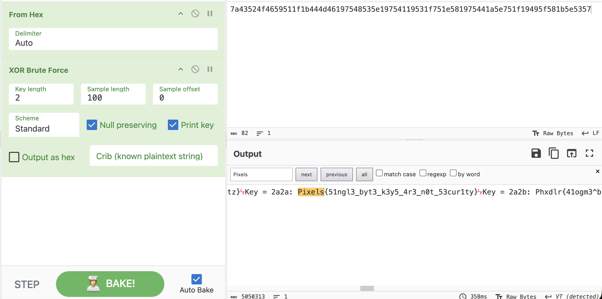

# Snake Oil — Writeup

**Category:** Crypto

## TL;DR

a company says it has military grade encryption, but it's just repeated XOR with a single byte. That means only 256 keys to try. We put the ciphertext into CyberChef, brute forced XOR with every single-byte key, and searched for the one that produces a message starting with `Pixels{` (we know that all flags start with Pixels{).

## Recon

We got only one file, `ciphertext.txt`, which is one line of hex:

```
7a43524f4659511f1b444d46197548535e19754119531f751e581975441a5e751f19495f581b5e5357
```

## The vulnerability

XORing single byte repeatedly is one of the worst forms of encryption. Since always the same byte is applied for every message byte, there are only 256 possible keys overall.

## What we did

we used CyberChef:

1. Opened up the hex ciphertext as an input (`From Hex`).
2. Applied the `XOR Brute Force` recipe to generate outputs for all 256 possible single-byte keys.
3. Added `Pixels` as a crib/filter so that CyberChef would automatically highlight the ciphertext that includes it, and not require us to sift through all 256 garbage outputs manually.

The rest was checked visually after being identified by CyberChef since the rest was simply noise.


## Root cause

Single-byte XOR is not encryption at all since there are only 256 possibilities for the key and CyberChef is able to try all of them and check the result instantly. It doesn't really matter the encryption method when there's no mention of the key size.