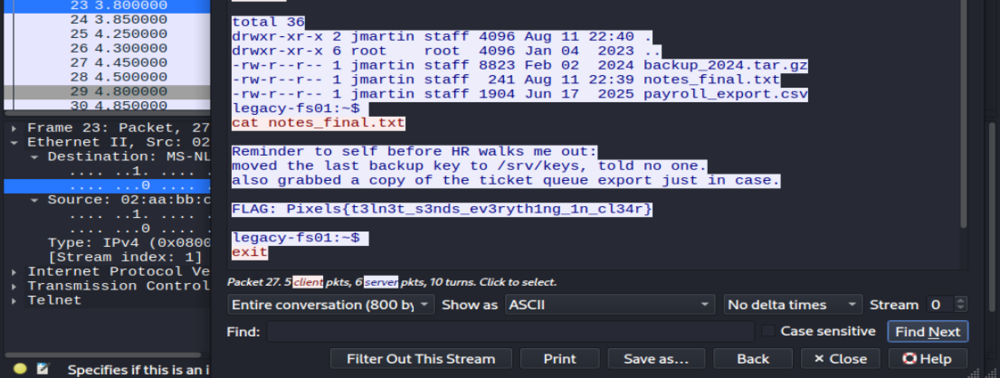

Exit Interview · MD
# The Exit Interview — Writeup
 
**Category:** Forensics
 
## TL;DR
 
The capture consists of a single telnet session on an old file server. We imported it into Wireshark, right-clicked a packet at the end, and chose Follow → TCP Stream to examine the entire session in one shot, login, directory list, and `cat` of a text file containing the flag.
 
## Recon
 
Single file to play around with: `incident_0842.pcap`. Opened it up in Wireshark, all of the packets part of one conversation. And the port number made it clear: port 23, which is telnet and transmits everything in the clear.

## What we did
 
Rather than going through the packets one by one, we clicked on the last packet with data in the stream with our right mouse button, and selected **Follow → TCP Stream**, which puts all the interaction into one readable transcript rather than many packets.
 
The reconstructed connection included the complete login and shell interaction:
 
- login banner for machine `legacy-fs01`
- username and password, both of which are transmitted in plain text, because this is telnet
- login successful, followed by access to the shell prompt
- an `ls -la` command, displaying some files in the user's home directory, including one named `notes_final.txt`
- `cat notes_final.txt`, and the server responded with the content of this file.
This `notes_final.txt` file was left behind by the soon-to-be-former employee as a farewell message, containing the flag in plaintext form.

## Root Cause

There is no encryption at all on Telnet, everything we read from the wire, from passwords to keystrokes and even files, is being transmitted in plain text. Anyone who is able to intercept packets traveling between the client and the server (exactly what the IT department did in this case) is able to read an entire session, including passwords, by simply reconstructing the TCP stream. There is nothing to be decrypted since it is not there from the very beginning.